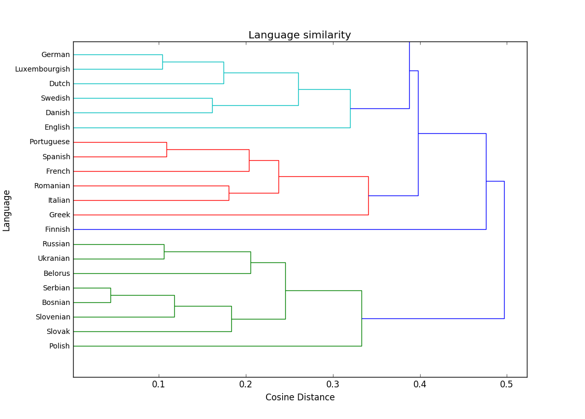

### 9. termin <sub><sup>*(24.5.2017)*<sup><sub>
- osnove uporabe strojnega učenja

***
#### Naloga 1
V direktoriju ```human_rights``` so deklaracije človekovih pravic za nekaj evropskih držav. Tvoja naloga je, da na podlagi teh besedil ugotoviš kateri jeziki so si med seboj najbolj podobni.

Brez skrbi, večinoma je naloga že rešena, ti boš moral le zapisati nekaj formul in uporabiti nekaj funkcij.

Podobnost med dvema jezikoma bomo merili s kosinusno razdaljo, ki se jo izračuna takole:


Ko imaš enkrat to implementirano, moraš le še za vsako kombinacijo dveh jezikov izračunati njuno medsebojno razdaljo in jo shraniti v nek seznam. Ostalo bo prevzel scipy.

Če si vse rešil pravilno bi moral dobiti nekaj takega:


***
#### Dodatki za Naloga 1
Potrebne knjižnjice:
```
unidecode
numpy
scipy
```
